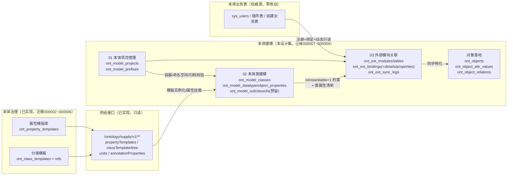

# 本体建模功能 · 详细设计文档集

> 版本：v1.0 ｜ 日期：2026-09-06 ｜ 分支：dq ｜
> 参考实现：东清项目（dongqing，芋道 yudao-cloud + Vben Admin 5）本体建模功能
> 参考文档：《本体建模功能》DD7~DD9 详细设计（芋道适配版，位于 dongqing 仓库 `docs/ontology/本体建模功能/`）+《多模块建对象详细设计》（位于 `docs/ontology多模块建对象/`，**旧版方案**）
> 参考前端：dongqing 仓库 `web/apps/web-antd/src/views/ontology/`（**权威实现**）

---

## 文档目录

| 编号 | 文档 | 内容 | 对应参考 | 页面路由 |
|---|---|---|---|---|
| 01 | [01-本体项目管理详细设计.md](./01-本体项目管理详细设计.md) | 本体项目（建模域顶层容器）、命名空间基址、IRI 前缀注册、序列化策略、状态机 | DD7（M5/FR-10） | `/ontology/model/project` |
| 02 | [02-本体类建模详细设计.md](./02-本体类建模详细设计.md) | 类实体 CRUD、IRI 生成、分类模板实例化（复制字段值+溯源）、类详情内嵌数据/对象属性维护、属性模板批量挂载 | DD8（M6/FR-11）+ DD9 属性部分（FR-12/13） | `/ontology/model/class` |
| 03 | [03-外部模块关联详细设计.md](./03-外部模块关联详细设计.md) | 外部模块/表注册（探测）、类绑定配置（主表+子表+属性绑定）、试运行、同步中心（全量/增量/水位/孤儿）、对象落地最小模型 | 《多模块建对象》（FR-19，旧方案被前端取代） | `/ontology/model/extbinding` |

## 一图看懂



治理域是建模域的**模板底座**：建模侧不建模板，实例化 = 从治理资产**复制字段值**并留下溯源（templateCode/classificationCode）。

## 技术栈适配总则（芋道 → gin-vue-admin）

| 项 | 参考实现（芋道/Vben） | 本项目（gin-vue-admin） |
|---|---|---|
| 后端框架 | Spring Boot 3 + MyBatis-Plus（yudao-cloud 微服务） | Go + Gin + GORM（单体的领域目录） |
| 模块组织 | `yudao-module-ontology` 独立服务（端口48094） | `server/{model,service,api,router}/ontology/` 领域目录 + enter.go 聚合（治理域已建，建模沿用） |
| 基类 | `BaseDO`（creator/updater/deleted） | `global.GVA_MODEL`（uint 自增 + CreatedAt/UpdatedAt/DeletedAt），业务审计 `CreatedBy/UpdatedBy` 自行声明并由 API 层填充 |
| 响应 | `CommonResult{code,msg,data}` | `response.Ok*/Fail*` `{code,data,msg}`（0 成功 / 7 失败） |
| 分页 | `PageParam{pageNo,pageSize}` / `PageResult` | `request.PageInfo`（page/pageSize/keyword）+ `response.PageResult{list,total,page,pageSize}` |
| API 风格 | `/ontology/model/project/page`、REST 动词、路径参数 | camelCase 动词扁平路由：`/ontology/modelProject/getModelProjectList` 等（对齐治理域既有范式，无路径参数） |
| 权限 | `@PreAuthorize('ontology:model:class:create')` 按钮码 | casbin 按 `(path, method)` 鉴权 + `sys_apis`/`casbin_rule` 幂等种子（Go）；建模写接口额外授「建模师」角色 |
| 事务 | `@Transactional(rollbackFor)` | `global.GVA_DB.Transaction(func(tx *gorm.DB) error)` |
| 定时补偿 | Spring `@Scheduled`（DD9 层级回推，后续需求） | 本期无调度需求；届时用 `server/task` 或 cron 框架 |
| 数据库迁移 | Flyway 集中式 V14~V16 / V105~V106 | golang-migrate `server/migrations/000007~000009`（up/down 成对、幂等、仅 PostgreSQL） |
| 字典 | `system_dict_type` + `CellDict` | `sys_dictionaries`/`sys_dictionary_details`（迁移 SQL 种入）+ `gvaDict`/`gvaDictSelect` 渲染；**extbinding 状态枚举沿用前端本地 options，不种字典** |
| 前端表格 | `useVbenVxeGrid` | `GvaGrid` + `useGvaGrid()`（分页协议 `{page,pageSize,...}` → `{code,data:{list,total}}`） |
| 前端表单/弹层 | `useVbenModal`/`useVbenDrawer` + useVbenForm schema | `el-drawer`（主表单）/ `el-dialog`（次级弹窗）+ `el-form`（dialogType add/edit） |
| 前端请求 | `requestClient` | `@/utils/request` 的 `service()`（自动解包） |
| 菜单 | 后端菜单动态路由 + Flyway 菜单 SQL（6039+菜单段） | 复用顶级目录 `ontology` + 新增 `model` 子目录（routerHolder），URL 与参考一致；`server/initialize/ontology_seed.go` 幂等种子 |

## 全局约定（三份设计共用）

- **冲突裁定规则**：参考设计文档与东清前端实现冲突时，**以前端实现为准**。三个典型案例：
  1. 03 外部模块关联：旧文档「类上加 biz_* 8 字段 + ont_object_mapping」被前端「注册表/绑定/同步中心三域」**整体取代**（02 类表单已无映射分区）；
  2. 02 类建模：DD8 的左树右表被前端**单表页**取代；类详情内嵌完整属性维护纳入范围；`isInstantiable` 列为前端新增；
  3. 对象属性 range：DD9 必填被前端**可选**取代。
- **表前缀**：建模/外部关联表沿用 `ont_model_` / `ont_ext_` / `ont_object` 前缀 + 复数蛇形命名，GORM 显式 `TableName()`。
- **软删除与唯一索引**：GORM `DeletedAt`；业务唯一索引用 PG 部分索引 `WHERE deleted_at IS NULL`（03 的「单类单生效」为 `WHERE binding_status=1 AND deleted_at IS NULL` 复合条件部分索引）。
- **治理域边界（R-23 适配）**：建模域只调治理域只读查询（`GetClassTemplateInherited`、供给接口），**不写治理域表**；`ont_class_hierarchies` 镜像回推属后续层级功能。
- **迁移版本号分配**：000007=本体项目管理、000008=本体类建模、000009=外部模块关联（当前库最大版本 000006）；**新增迁移前须核对 `server/migrations/` 当前最大版本号**。
- **菜单结构**：顶级目录 `ontology`（种子将标题「本体治理」更新为「本体」）+ 子目录 `model`（本体建模，routerHolder）+ 三个叶子菜单 project/class/extbinding → 最终 URL `/ontology/model/{project|class|extbinding}` 与参考前端一致。
- **归档传导**：01 提供 `AssertProjectWritable(projectId)` 公共校验，02/03 所有写入口复用。
- **跨功能依赖**：03 依赖 01（项目下拉/归档校验）与 02（isInstantiable=1 的类、类属性清单、对象属性 range 目标类）；02 依赖 01 与治理域供给；01 独立。

## 实施顺序建议

```
01 本体项目管理（迁移 000007；独立，先行）
   └─> 02 本体类建模（迁移 000008；依赖 01 + 治理域供给/继承视图，二者均已就绪）
        └─> 03 外部模块关联（迁移 000009；依赖 01/02；含对象落地三表与同步引擎，工作量最大）
```

后续需求（不在本设计集）：属性独立查询页、类层级编辑与镜像回推补偿（DD9 FR-14）、RDF 序列化/解析（DD10）、可视化画布（DD11）、本体对象管理页（DD12）、定时同步调度、多数据源。
