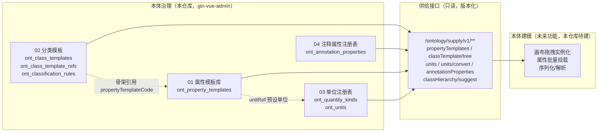

# 本体治理功能 · 详细设计文档集

> 版本：v1.0 ｜ 日期：2026-09-06 ｜ 分支：dq ｜
> 参考实现：东清项目（dongqing，芋道 yudao-cloud + Vben Admin 5）本体模板化治理功能
> 参考文档：《本体模板化治理功能》M0~M4 详细设计（芋道适配版，位于 dongqing 仓库 `docs/ontology/本体模板化治理/`）
> 参考前端：dongqing 仓库 `web/apps/web-antd/src/views/ontology/`（**权威实现**）

---

## 文档目录

| 编号 | 文档 | 内容 | 对应参考里程碑 |
|---|---|---|---|
| 01 | [01-属性模板库详细设计.md](./01-属性模板库详细设计.md) | 属性模板（数据属性 + 对象属性同构）CRUD、弃用、别名、供给 | M1 |
| 02 | [02-分类模板详细设计.md](./02-分类模板详细设计.md) | 分类模板树（物化路径）、分类编码规则、结构骨架子表、继承视图、供给 | M2 |
| 03 | [03-单位注册表详细设计.md](./03-单位注册表详细设计.md) | 量纲 + 单位（引用 QUDT）、高精度换算、换算试算、供给 | M3 |
| 04 | [04-注释属性注册表详细设计.md](./04-注释属性注册表详细设计.md) | ont:xxx 注释属性注册表 CRUD、Excel 导出、供给 | M4 |

## 一图看懂



治理四资产是本体建模功能的**前置治理底座**：建模侧不直接建模板，而是从供给接口拉取治理资产，通过 `templateRef` 溯源挂载。

## 技术栈适配总则（芋道 → gin-vue-admin）

| 项 | 参考实现（芋道/Vben） | 本项目（gin-vue-admin） |
|---|---|---|
| 后端框架 | Spring Boot 3 + MyBatis-Plus | Go + Gin + GORM |
| 模块组织 | `yudao-module-ontology` 独立模块 | `server/{model,service,api,router}/ontology/` 领域目录 + enter.go 聚合 |
| 基类 | `BaseDO`（creator/updater/deleted int2） | `global.GVA_MODEL`（ID uint 自增 + CreatedAt/UpdatedAt + DeletedAt 软删除），业务审计字段 `CreatedBy/UpdatedBy` 自行声明并由 API 层填充 |
| 主键 | bigint 雪花 + `@KeySequence` | uint 自增（PG 序列，GORM 默认） |
| 响应 | `CommonResult{code,msg,data}` code=0 | `response.Ok*/Fail*` `{code,data,msg}` code=0 成功 / 7 失败 |
| 分页 | `PageParam/PageResult` | `request.PageInfo`（page/pageSize/keyword）+ `response.PageResult{list,total,page,pageSize}` |
| 权限 | `@PreAuthorize('ontology:xxx:op')` | casbin 中间件按 `(path, method)` 鉴权 + `sys_apis`/`casbin_rule` 幂等种子（Go） |
| 事务 | `@Transactional` | `global.GVA_DB.Transaction(func(tx *gorm.DB) error {...})` |
| 高精度 | `BigDecimal` | `github.com/shopspring/decimal`（需从 indirect 提升为直接依赖） |
| Excel | FastExcel `ExcelUtils.write` | `github.com/xuri/excelize/v2`（已在 go.mod） |
| 数据库迁移 | Flyway 集中式 V10~V13 | golang-migrate `server/migrations/000002~000005`（up/down 成对、幂等、仅 PostgreSQL） |
| 字典 | `system_dict_type/data` + `CellDict` | `sys_dictionaries`/`sys_dictionary_details` + `getDict()`/GvaGrid `gvaDict` 渲染器 |
| 前端表格 | `useVbenVxeGrid` | `GvaGrid` + `useGvaGrid()`（分页协议 `{page,pageSize,...}` → `{code,data:{list,total}}`） |
| 前端表单 | `useVbenModal + useVbenForm` | `el-drawer` + `el-form`（dialogType add/edit 区分） |
| 前端请求 | `requestClient` | `@/utils/request` 的 `service()`（自动解包 `{code,data,msg}`） |

## 全局约定（四份设计共用）

- **冲突裁定规则**：参考设计文档与东清前端实现冲突时，**以前端实现为准**。各文档 §1.3 列出差异裁定表。
- **表前缀**：所有表以 `ont_` 前缀 + 复数蛇形命名（如 `ont_property_templates`），GORM 显式 `TableName()`。
- **软删除**：GORM `DeletedAt`；业务唯一索引用 PG 部分索引 `WHERE deleted_at IS NULL`，逻辑删后允许业务编码复用。
- **状态位**：本体域沿用前端语义——`deprecated`（0/1 弃用标记，属性模板）、`status`（0 正常/1 停用，单位），**不采用**本项目公司模块的 1/2 语义。
- **builtin 保护**：`source='builtin'`（随迁移种子分发）记录不可编辑、不可删除；编码字段（templateCode/unitCode）在前端表单中禁用，后端 Service 双重校验。
- **供给接口**：`/ontology/supply/v1/**` 只读、GET、版本化路径，权限独立登记为「本体供给」API 组（授予建模师角色），与治理 CRUD 权限分离。
- **迁移版本号分配**：000002=属性模板库、000003=分类模板、000004=单位注册表、000005=注释属性注册表；各功能文档只描述自己的迁移，**新增迁移前须核对 `server/migrations/` 当前最大版本号**。
- **菜单与 API 种子**：统一在 `server/initialize/ontology_seed.go` 幂等注册（范式参照 `data_permission.go`），各文档列出自己的菜单/API 清单。

## 实施顺序建议

```
01 属性模板库（迁移 000002 + 字典 ont_property_kind/ont_source）
   └─> 02 分类模板（迁移 000003；骨架引用属性模板，依赖 01）
   └─> 03 单位注册表（迁移 000004；可与 02 并行；属性模板 unitRef 联动生效）
        └─> 04 注释属性注册表（迁移 000005；独立，可任意时机）
```

供给接口随各功能一并交付；建模侧（画布/挂载/序列化）为后续独立需求，不在本设计集范围内。
