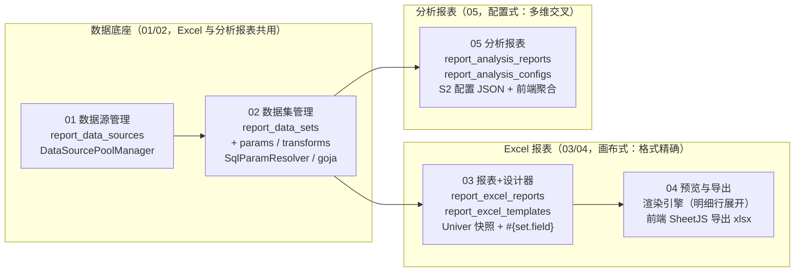

# 报表平台功能 · 详细设计文档集

> 版本：v1.1（已按 dongqing **实际实现**（`server/yudao-module-report` + `web/apps/web-antd/src/{views,api}/report`）逐功能校准）｜ 日期：2026-09-07 ｜ 分支：dq ｜
> 参考实现：东清项目（dongqing，芋道 yudao-cloud + Vben Admin 5）报表平台（参考了 aj-report 开源项目）
> 参考文档：dongqing 仓库 `docs/report/` 目录（PRD / 详细设计-M1~M3 / 详细设计-分析报表 / 开发计划 / 评审后续优化）
> 任务：将报表平台迁移至本程序（gin-vue-admin，Go+Gin+GORM 后端 + Vue3+Element Plus 前端），为每个功能编写详细设计

---

## 文档目录（按功能依赖排序）

| 编号 | 文档 | 内容 | 依赖 | 页面路由 |
|---|---|---|---|---|
| 01 | [01-数据源管理详细设计.md](./01-数据源管理详细设计.md) | 数据源 CRUD、连接池管理器（多数据库驱动适配）、密码 AES 加密、测试连接 | 无（独立，先行） | `/report/dataSource` |
| 02 | [02-数据集管理详细设计.md](./02-数据集管理详细设计.md) | 数据集主子表（参数/转换）、SQL 参数化防注入、HTTP 取数、goja JS 转换沙箱、默认值动态表达式、测试预览、服务端分页查询 | 01（数据源连接池） | `/report/dataSet` |
| 03 | [03-Excel报表设计与模板管理详细设计.md](./03-Excel报表设计与模板管理详细设计.md) | 报表元数据/模板 CRUD、复制、Univer 在线设计器（列表页内 Tab）、bind-datasets 独立关联、拖拽绑定 `#{set.field}`、导入 xlsx、添加到菜单 | 02（数据集字段/参数） | `/report/excelReport`（设计器为页内 Tab） |
| 04 | [04-Excel报表预览与导出详细设计.md](./04-Excel报表预览与导出详细设计.md) | 后端渲染引擎（完整占位符定位主数据集+明细行多数据集对齐展开+行数裁剪）、平铺参数化查询、主数据集服务端分页、**前端 SheetJS 导出 xlsx** | 03（模板 JSON）、02（queryPage） | 预览页隐藏路由 `/report/reportpreview` |
| 05 | [05-分析报表详细设计.md](./05-分析报表详细设计.md) | 分析报表 CRUD/复制、S2 配置式设计器（行头/列头/数值/聚合/样式）、前端聚合层、预览取数 | 02（数据集完全复用）；与 03/04 平行 | `/report/analysisReport` + 预览隐藏路由 |

## 一图看懂



- **数据源/数据集是共用底座**：Excel 报表（多数据集）与分析报表（单数据集）都从 02 取数，不重复建设。
- **Excel 报表 = 后端渲染**：占位符替换与明细行扩展发生在 Go 渲染引擎（04）。
- **分析报表 = 前端渲染**：后端只返回明细数据，聚合（SUM/COUNT/AVG/MIN/MAX/NONE）由浏览器端聚合层 + AntV S2 完成（05）。

## 技术栈适配总则（芋道/yudao → gin-vue-admin）

| 项 | 参考实现（芋道/Vben） | 本项目（gin-vue-admin） |
|---|---|---|
| 后端框架 | Spring Boot 3 + MyBatis-Plus（yudao-cloud report 微服务，端口 48084） | Go + Gin + GORM 单体的领域目录 `server/{model,service,api/v1,router}/report/` + enter.go 聚合（沿用 ontology 领域范式） |
| 基类/审计 | `BaseDO`（creator/updater/deleted）+ `@KeySequence` PG 序列 | `global.GVA_MODEL`（uint 自增 + CreatedAt/UpdatedAt/DeletedAt），业务审计 `CreatedBy/UpdatedBy` 自行声明并由 API 层经 `utils.GetUserInfo(c).Username` 填充 |
| 响应 | `CommonResult{code,msg,data}` | `response.OkWithMessage/OkWithData/OkWithDetailed/FailWithMessage`（`{code,data,msg}`，0 成功 / 7 失败） |
| 分页 | `PageParam{pageNo,pageSize}` / `PageResult` | `request.PageInfo`（page/pageSize/keyword）+ `response.PageResult{list,total,page,pageSize}` |
| API 风格 | REST 动词 `/report/excel-datasource/page`、`@PreAuthorize` 按钮码 | camelCase 动词扁平路由 `/report/dataSource/getDataSourceList`（对齐 ontology 既有范式，无路径参数）；写接口挂 `middleware.OperationRecord()` |
| 权限 | `@PreAuthorize('report:excel-datasource:create')` 按钮权限码 + system_menu 按钮型子项 | casbin 按 `(path, method)` 鉴权 + `sys_apis`/`casbin_rule` 幂等 Go 种子（`initialize/report_seed.go`）；GVA 无按钮级权限码，页面按钮不做细粒度隐藏（与 ontology 一致），后续可用 authorityBtn 机制增强 |
| 错误码 | `ErrorCodeConstants`（1_003_00x_xxx 码段） | 领域 sentinel error：`service/report/errors.go`（`var ErrSourceCodeDuplicate = errors.New("数据源编码已存在")` 等，中文消息直传前端） |
| 事务 | `@Transactional(rollbackFor)` | `global.GVA_DB.Transaction(func(tx *gorm.DB) error)` |
| 数据库迁移 | Flyway 集中式 V26/V27/V31/V32（建表+菜单种子 SQL） | golang-migrate `server/migrations/000010_*`（up/down 成对、幂等、仅 PostgreSQL，**写迁移前核对当前最大版本号**）；菜单/API/casbin 种子走 Go（`report_seed.go`），**不种字典**（枚举沿用前端本地 options，对齐 ontology extbinding 范式） |
| JS 转换沙箱 | GraalVM Polyglot JS（HostAccess.NONE 等沙箱配置） | `github.com/dop251/goja`（纯 Go ES5.1+ 解释器，**不注入任何宿主对象即天然无文件/网络 IO**；`vm.Interrupt` + 超时定时器限运行时长）——需新增依赖 |
| Excel 导出 | 后端 Apache POI + 二进制流下载 | **前端 SheetJS 导出**（对齐实现）：`preview(pageNo=1, pageSize=50000)` 拉全量渲染快照 → `exportSnapshotToXlsx`（值/合并/列宽，与 03 导入互逆）；后端 excelize 流式导出列后续迭代 |
| PDF 导出 | OpenPDF（STSong-Light 中文字体） | **本期不做**（无现成依赖，收益低）；导出仅 xlsx，PDF 列后续迭代（浏览器打印 / 引入 PDF 库再评估） |
| 外部 SQL 连接池 | HikariCP `DataSourcePoolManager`（JDBC 驱动按 sourceType 适配） | Go `database/sql` 每数据源独立 `*sql.DB`（`ConcurrentMap[sourceCode]*sql.DB`，SetMaxOpenConns/SetConnMaxLifetime），驱动按 sourceType 注册 |
| 多数据库驱动 | JDBC 驱动 JAR（POI pom 声明，信创驱动手动安装） | Go 驱动现实约束：**开箱支持 postgresql（pgx stdlib）/ mysql（go-sql-driver）/ sqlserver（go-mssqldb）——三者均已在 go.mod**；达梦（`gitee.com/chunanyong/dm`）/人大金仓/openGauss（pg 协议兼容）为纯 Go 驱动按需启用；**Oracle 需 CGO（godror），默认不启用**，类型枚举预留 |
| HTTP 数据集请求 | Spring `RestTemplate`（10s 连接/30s 读超时） | `net/http.Client{Timeout}`（连接 10s / 读 30s，领域内单例） |
| 密码加密存储 | yudao 加密组件 / Jasypt | 领域内 AES-GCM 工具（`service/report/crypto.go`），密钥 `config.yaml → report.aes-key`（32 字节 base64），密文格式 `enc:<base64(nonce+ciphertext)>`，前端脱敏 `******` |
| 字典 | `system_dict_type/data` + CellDict | 本报表平台不使用字典：类型枚举（数据源类型/参数类型/聚合方式等）用**前端本地 options 常量**（对齐参考实现 M1 的 `DATA_SOURCE_TYPE_OPTIONS` 做法） |
| 前端框架 | Vben Admin 5（vue 3.5 + ant-design-vue 4 + TS + useVbenVxeGrid + useVbenForm/Modal） | gin-vue-admin web（vue 3.5 + **element-plus** + **JS（非 TS）** + `GvaGrid`/`useGvaGrid()` + `el-drawer` 主表单 / `el-dialog` 次级弹窗 + `el-form` rules） |
| 前端请求 | `requestClient`（自动解包） | `@/utils/request` 的 `service()`（自动解包，`res.code === 0`）；二进制下载用领域内 `downloadBlob` 帮助函数（fetch + x-token，见 04） |
| 菜单/路由 | 后端菜单驱动 + Flyway 菜单 SQL（6062+ id 段）+ hideInMenu 静态路由 | 后端菜单驱动 + `report_seed.go` 幂等 Go 种子（`sys_base_menus` + `sys_authority_menus`(888) + `sys_apis` + `casbin_rule`）；**设计器 = 列表页内 Tab**（对齐实现，非独立路由），**预览页 = hidden 菜单**（`Hidden: true` 仍注册路由），`router.push({ name, query: { reportCode } })` 跳转；「添加到菜单」用 **path 内嵌 query**（`reportpreview?reportCode=x`）+ asyncRouter 拆分小改造（03 §5.8） |
| 前端代码语言 | TypeScript（.ts + interface） | **JavaScript**：类型约定用 JSDoc 注释表达（重要适配点，参考实现的 TS interface 改写为 JSDoc `@typedef`） |
| 在线表格引擎 | Univer `@univerjs/presets`（pin 0.25.x，Vue3 命令式集成） | 同样采用 Univer（选型结论直接沿用：Luckysheet 已归档废弃）；集成铁律不变：`shallowRef` 持有实例、`onBeforeUnmount` dispose、快照只读必须走命令 API |
| 分析表格引擎 | `@antv/s2@2.7.2` + `@antv/s2-vue@2.2.0`（pin patch） | 同样采用；`@antv/g2` 可选 peer 用本地桩 + vite alias；`rawData` 用 `shallowRef` |

## 全局约定（五份设计共用）

- **冲突裁定规则**（优先级从高到低）：① 参考设计文档与 dongqing **实际实现**冲突时，**以实际实现为准**（实装的渲染引擎语义、bind-datasets 独立接口、平铺参数、前端导出、页内 Tab 设计器、添加到菜单等均已按实现校准进各文档 v1.1）；② 参考设计文档之间不一致时，以较晚的评审修订版为准（迁移即终态，不复现中间版本）；③ 参考实现与本项目骨架冲突时，以本项目骨架为准（下表全部条目）。
- **表前缀**：`report_` 前缀 + 复数蛇形命名（`report_data_sources` 等，对齐 `ont_model_projects` 惯例），GORM 显式 `TableName()`。
- **软删除与唯一索引**：GORM `DeletedAt`；业务唯一索引用 PG 部分索引 `WHERE deleted_at IS NULL` + Service 预查重双保险（不声明 gorm uniqueIndex tag）。
- **子表关联键**：数据集参数/转换子表用 `set_code`（varchar）关联而非 `set_id`，模板/配置表用 `report_code` 关联（沿用参考实现语义：编码全局唯一、与 aj-report 血统一致）；**主子表保存采用"事务内先删子表再批量插入"**（不移植 diffList：子表行数少、无外部引用、无需保持子行 ID 稳定，先删后插更简单可靠）。
- **迁移版本号分配**：报表平台全部 8 张表**一次性预建**在 `000010_create_report_platform`（对齐参考实现 V26"6 张表一次建"的做法；各功能文档不再新增迁移，仅引用 000010 中自己的表），**迁移尾部附演示数据集种子**（含 `${param}`/`<if>` 条件 SQL 与 `case_result`，对齐实现 V28/V29）。**新增迁移前须核对 `server/migrations/` 当前最大版本号**（当前规划基线 000009=外部模块关联，000010=报表平台）。
- **ID 类型**：`global.GVA_MODEL.ID` 为 uint；迁移 DDL 用 `bigserial`；前端统一 `ID` 字段名。
- **菜单结构**：顶级目录 `report`（自定义报表，对齐实现 V30 更名语义）+ 四个叶子菜单 `dataSource`/`dataSet`/`excelReport`/`analysisReport` + **两个 hidden 菜单** `reportExcelViewer`（path=reportpreview）/`reportAnalysisPreview`（path=preview）（见各文档 §六；设计器均为列表页内 Tab，无独立菜单）。
- **模板两路独立维护**（对齐实现）：`save-template` 只写 `json_str/set_param`，`bind-datasets` 只写 `set_codes`，两者均对模板行按 `report_code` upsert——打破 setCodes 与 jsonStr 的循环依赖。
- **查询参数平铺**（对齐实现）：预览/渲染参数为**平铺** `{paramName: value}`（跨数据集同名参数去重，`dataset-params` 平铺返回）；dateRange 前端拼 `"起,止"` 提交、后端统一拆 `_start/_end`；默认值表达式（today/thisMonth…）由**后端解析**（前端仅 sampleItem 预填）。
- **占位符约定**：模板单元格 `#{setCode.fieldName}` 有两态——**完整占位符**（整格匹配，04 用于判定明细模板行）与**片段占位符**（混在文本中替换）；SQL/HTTP 中 `${paramName}`（查询参数）；`<if param="x">…</if>`（条件片段，空值整体剥离）。
- **行数上限**：数据集全量查询上限 50000 行（防 OOM；无转换 SQL 走服务端分页不受影响）；分析报表预览超限回退分页截断并置 `truncated=true`；前端导出按 `pageSize=50000` 一次拉全量。
- **跨功能依赖校验落点**：数据源删除 ← 数据集引用（02 落地）；数据集删除 ← Excel 模板 `set_codes` + 分析报表 `set_code` 引用（03/05 落地，共用 02 的 `ErrSetReferencedByReport`）。

## 实施顺序建议

```
01 数据源管理（迁移 000010 建表；连接池管理器为 02 的取数底座）
   └─> 02 数据集管理（参数/转换/防注入/测试预览；为 03/04/05 提供取数与字段来源）
        ├─> 03 Excel报表设计与模板管理（Univer 设计器 + 拖拽绑定 + xlsx 导入）
        │     └─> 04 Excel报表预览与导出（渲染引擎 + 服务端分页 + 前端导出）
        └─> 05 分析报表（S2 配置式设计器 + 前端聚合 + 预览取数，可与 03/04 并行）
```

## 后续迭代（不在本设计集）

- 报表分享（免登录公开预览）、定时调度/邮件推送、协作编辑与模板版本管理；
- 聚合绑定语法 `#{=SUM(set.field)}` 与 Univer 单元格 custom 结构化 metadata（参考《excel-report-followup》P1）；
- 拖拽"悬停落格"（dragover 像素→行列 hit-test，参考 P2）、PDF 导出、Excel 模板缩略图、访问/下载计数（参考 P6）；
- **后端 excelize 流式导出**（样式保真，复用 04 渲染引擎全量渲染）、**明细区合并单元格位移**（实现明确不做的已知限制，模板设计规范暂约束合并仅用于标题区）、**case_result「保存为案例」维护入口**（03 左栏字段/05 白名单的数据源）、**Excel 报表 get-by-code 接口**（现为 page 精确过滤）、禁用报表拦截与数据集级容错（warnings）；
- 参数高级字段（dictType/customOptions/dateFormat）的**编辑 UI**（消费链路 04 已通）；
- 服务端聚合/OLAP 预计算、多数据集关联分析、S2 自定义主题调色板、Elasticsearch 等非关系型数据源。
