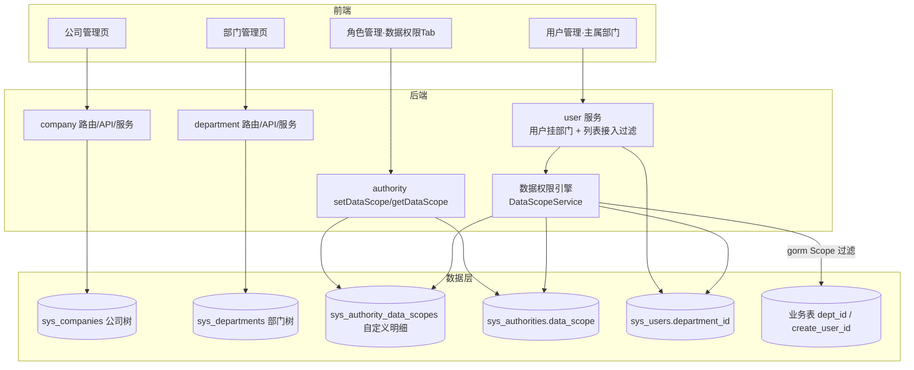
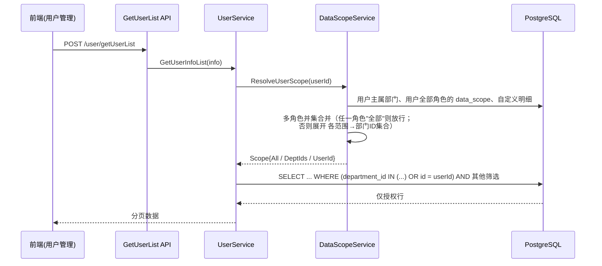

# 01 总体设计

## 1. 背景与目标

### 1.1 现状分析

gin-vue-admin（本项目）当前的权限体系只有两层：

| 层次 | 现有实现 | 说明 |
| --- | --- | --- |
| 功能权限（能不能调） | casbin（`casbin_rule`：authorityId + path + method） | 只控制 API 访问，**不看数据行** |
| 资源权限（能管理谁） | `sys_data_authority_id`（角色 m2m 角色） | 容易被误解为"数据权限"，实际是**角色可管理的下级角色**（角色树），不做行级过滤 |

也就是说：**同一张业务表，一旦某角色有查询 API 权限，就能看到全表数据**。缺少企业应用必备的组织机构维度（公司 / 部门 / 员工归属）与行级数据范围控制。

### 1.2 目标

参考 JeeSite 数据权限管理体系，在尽量贴合 gin-vue-admin 既有代码风格（GVA_MODEL、enter 聚合、GvaGrid 前端表格体系）的前提下实现：

1. **公司管理**：多级公司树（集团 → 子公司 → 分公司），编码唯一，支持启停用。
2. **机构部门管理**：部门树挂靠公司，用户归属唯一主部门。
3. **数据范围配置**：角色级六档数据范围 + 自定义明细（勾选公司/部门）。
4. **数据权限引擎**：请求时解析当前用户（多角色）的可见数据范围，展开为部门 ID 集合，以 gorm Scope 形式对任意业务查询追加 `WHERE` 条件；提供一行代码的接入方式。
5. **不破坏存量行为**：存量角色默认数据范围 = 全部数据，存量接口行为不变。

### 1.3 非目标（本期不做，预留扩展点）

- 用户级数据范围覆盖（JeeSite 的 `js_sys_user_data_scope`）：用户明细覆盖角色范围。表结构已预留，引擎预留 `ResolveUserScope` 扩展点。
- 菜单/按钮级数据规则（JeeSite 的 `js_sys_menu_data_scope`，按菜单粒度配置不同范围）。
- 字段级权限（JeeSite 的 `js_sys_role_field_scope`）。
- 员工/岗位模型（JeeSite 的 `js_sys_employee` + `employee_office` 多机构兼职 + 岗位）。本期采用"用户直接挂主部门"的简化模型，一人一部。多部门兼职可通过新增 m2m 表扩展，见 02 篇 5.2。

## 2. JeeSite 数据权限体系调研

调研对象：本地 Docker PostgreSQL `jeesite` 库（JeeSite 5，flyway 初始化的完整库），重点看了以下表：

### 2.1 组织模型

| JeeSite 表 | 作用 | 关键设计 |
| --- | --- | --- |
| `js_sys_company` | 公司树 | `parent_code` + `parent_codes`（物化路径，如 `0,1000,1001,`）+ `tree_level`/`tree_sort`/`tree_leaf`，前缀 LIKE 查子树 |
| `js_sys_office` | 机构部门树 | 同上树字段；`office_type` 区分机构性质；独立于公司树 |
| `js_sys_company_office` | 公司 ↔ 机构关联 | 一家公司挂多个机构 |
| `js_sys_employee` / `js_sys_employee_office` | 员工（关联用户）/ 员工归属机构（多机构 + 岗位） | 用户与组织解耦：用户 ↔ 员工 ↔ 机构(多) |

### 2.2 数据范围模型

| JeeSite 表 | 作用 |
| --- | --- |
| `js_sys_role.data_scope` | 角色默认数据范围（字典 `sys_role_data_scope`） |
| `js_sys_role_data_scope` | 角色数据范围**明细**（ctrl_type/ctrl_data/ctrl_permi，按权限字符串控制数据粒度） |
| `js_sys_user_data_scope` | 用户级覆盖明细 |
| `js_sys_menu_data_scope` | 菜单级数据规则（rule_type + rule_config 表达式，按菜单粒度生效） |

`sys_role_data_scope` 字典实测值（本机 jeesite 库）：

| 值 | 含义 |
| --- | --- |
| 0 | 本人数据 |
| 1 | 全部数据 |
| 2 | 自定义数据 |
| 3 | 本部门数据 |
| 4 | 本公司数据 |
| 5 | 本部门和本公司数据 |

### 2.3 执行方式

JeeSite 在 Service/DAO 层通过 `DataScope` 注解式声明 + 拦截器改写 SQL：把 `create_by`（创建人）与 `create_dept`（创建部门，物化路径）条件动态拼进 WHERE，子树用 `parent_codes LIKE '0,1001,%'` 前缀匹配。

### 2.4 本项目的取舍

| JeeSite 机制 | 本项目取舍 | 原因 |
| --- | --- | --- |
| 公司树 + 机构树两棵树 | **保留**，公司树独立、部门树挂公司（`company_id` 外键，替代 m2m 关联表） | 一对一挂靠足够常见，少一张关联表；需要一家部门多公司共享时再加 m2m |
| 物化路径 `parent_codes` | **保留**（`parent_ids`，格式 `0,1,3,`） | 子树查询一次 LIKE 搞定，免递归 |
| 角色 `data_scope` 六档 | **保留**并重排枚举值（见 3.2） | 语义更清晰（本部门/本部门及以下分档），文档给出与 JeeSite 的映射 |
| 角色自定义明细 | **简化**为「勾选公司/部门」明细表 `sys_authority_data_scopes` | JeeSite 的 ctrl_permi 按权限字符串控制过细，中小企业场景勾组织树更直观 |
| 用户级覆盖 / 菜单级规则 / 字段权限 | 本期不做 | 渐进式落地，模型预留 |
| 员工表解耦 | **简化**为 `sys_users.department_id` 直挂主部门 | gva 用户模型轻，避免引入员工/岗位全套表 |
| 查询拦截改写 SQL | **显式 gorm Scope 接入**（`.Scopes(...)`） | gva 无注解拦截文化；显式接入可控、可测、可绕行 |

## 3. 核心概念与术语

- **公司（Company）**：法人/经营主体，自成一棵树。表 `sys_companies`。
- **部门（Department / 机构）**：行政组织单元，自成一棵树，每个节点必须挂靠一家公司。表 `sys_departments`。
- **主属部门**：用户唯一的部门归属，`sys_users.department_id`。用户所属公司由主属部门推导（`department.company_id`）。
- **数据范围（DataScope）**：角色对业务数据行的可见范围档位。
- **数据权限条件（DataScope Condition）**：引擎解析产物——部门 ID 集合 + 本人标志，翻译成 SQL 即 `dept_col IN (...) OR user_col = ?`。
- **业务接入列**：业务表上的 `dept_id`（数据归属部门）列；可选 `create_user_id`/自有用户列用于"仅本人"。

### 3.2 数据范围枚举（本项目）

| 值 | 名称 | 语义 | JeeSite 对应 |
| --- | --- | --- | --- |
| 1 | 全部数据 | 不加过滤条件 | 1 全部数据 |
| 2 | 自定义数据 | 明细勾选的公司/部门（含其子孙）并集 | 2 自定义数据 |
| 3 | 本公司数据 | 主属部门所在公司的全部部门 | 4 本公司数据 |
| 4 | 本部门及以下 | 主属部门子树（含自身） | 3 本部门数据（JeeSite 的"本部门"含下级） |
| 5 | 本部门数据 | 仅主属部门自身，不含下级 | （JeeSite 无此档） |
| 6 | 仅本人数据 | 仅本人相关行 | 0 本人数据 |

> 兼容性：`sys_authorities.data_scope` 列默认值 = 1（全部数据），存量角色升级后行为不变。

## 4. 总体架构

## 5. 核心流程：一次受控查询

以「用户管理列表」为例（本期的参考实现，等价于任何业务列表）：

多角色合并规则（与 JeeSite 一致：**多角色取并集、范围就宽**）：

1. 任一角色范围 = 全部数据 → 最终 = 全部数据（短路）。
2. 否则各角色的部门 ID 集合求并集；"仅本人"不贡献部门集合，但本人条件恒可用。
3. 用户未设置主属部门时，机构类范围（2/3/4/5）**退化为仅本人**（宁紧勿松）。

## 6. 设计原则

1. **默认放行**：一切存量角色 `data_scope=1`，升级零行为变化；引擎有总开关 `data-permission.enable`。
2. **显式接入**：数据过滤只发生在业务代码主动 `.Scopes(...)` 的地方，不搞全局 SQL 改写，避免隐式行为（与 JeeSite 拦截器方案的差异点，见 2.4）。
3. **失败关闭（fail-close）**：引擎解析出错时按"查不到数据"处理并记录 ERROR 日志，绝不放大权限。
4. **幂等种子**：菜单/API/casbin/演示数据种子全部按唯一键查重后插入，重启安全。
5. **贴合既有风格**：模型嵌 `GVA_MODEL`、四层 enter 聚合、GvaGrid 树表、抽屉表单，和现有系统模块长得一样。

## 7. 模块清单（对应代码位置）

| 模块 | 后端 | 前端 |
| --- | --- | --- |
| 公司管理 | `model/system/sys_company.go`、`service/system/sys_company.go`、`api/v1/system/sys_company.go`、`router/system/sys_company.go` | `web/src/view/superAdmin/company/company.vue`、`web/src/api/company.js` |
| 部门管理 | `model/system/sys_department.go`、`service/system/sys_department.go`、`api/v1/system/sys_department.go`、`router/system/sys_department.go` | `web/src/view/superAdmin/department/department.vue`、`web/src/api/department.js` |
| 数据范围配置 | `model/system/sys_authority_data_scope.go`、`service/system/sys_authority_data_scope.go` | `web/src/view/superAdmin/authority/components/dataScope.vue` |
| 数据权限引擎 | `service/system/sys_data_scope.go`（解析+Scope） | — |
| 用户挂部门 | `sys_user.go` 增列 + 列表接入 | `user.vue` 部门列 + 表单部门选择 |
| 迁移与种子 | `initialize/gorm.go`、`initialize/data_permission.go` | — |
