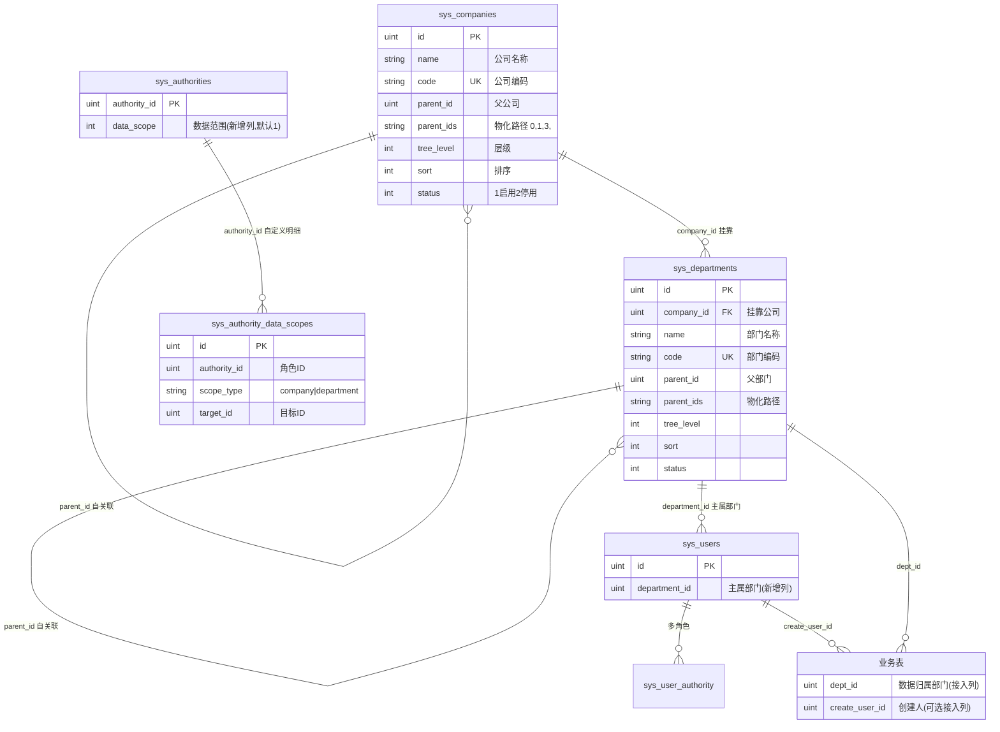

# 02 数据库设计

数据库：PostgreSQL（`gvadq`），ORM：gorm v2，表名复数（`singular: false`），结构体自动迁移（`AutoMigrate`）。

## 1. ER 图



## 2. 新增表

### 2.1 sys_companies（公司表）

| 字段 | 类型 | 约束/默认 | 说明 |
| --- | --- | --- | --- |
| id | bigserial | PK | 主键 |
| created_at / updated_at | timestamptz | | gorm 维护 |
| deleted_at | timestamptz | index | 软删 |
| name | varchar(100) | not null | 公司名称 |
| code | varchar(64) | not null，唯一索引 | 公司编码（对外稳定标识，类似 JeeSite `view_code`） |
| parent_id | bigint | 0 = 根，index | 父公司 ID |
| parent_ids | varchar(500) | not null，index | 物化路径：`0,` → `0,1,` → `0,1,3,`（含首尾逗号） |
| tree_level | int | not null | 层级（根=0），冗余便于展示/校验 |
| sort | int | 0 | 同级排序 |
| leader / phone / email / address / remarks | varchar | | 负责人、联系方式、地址、备注 |
| status | int | 1 | 1 启用 2 停用 |

PostgreSQL DDL（与 AutoMigrate 产物等价，手工建库时使用）：

```sql
CREATE TABLE sys_companies (
    id           bigserial PRIMARY KEY,
    created_at   timestamptz,
    updated_at   timestamptz,
    deleted_at   timestamptz,
    name         varchar(100) NOT NULL,
    code         varchar(64)  NOT NULL,
    parent_id    bigint       NOT NULL DEFAULT 0,
    parent_ids   varchar(500) NOT NULL DEFAULT '',
    tree_level   int          NOT NULL DEFAULT 0,
    sort         int          NOT NULL DEFAULT 0,
    leader       varchar(64)  DEFAULT '',
    phone        varchar(32)  DEFAULT '',
    email        varchar(128) DEFAULT '',
    address      varchar(255) DEFAULT '',
    remarks      varchar(255) DEFAULT '',
    status       int          NOT NULL DEFAULT 1
);
CREATE UNIQUE INDEX idx_sys_companies_code ON sys_companies (code) WHERE deleted_at IS NULL;
CREATE INDEX idx_sys_companies_parent_id ON sys_companies (parent_id);
CREATE INDEX idx_sys_companies_parent_ids ON sys_companies (parent_ids);
```

### 2.2 sys_departments（机构部门表）

在 `sys_companies` 基础上增加 `company_id`（挂靠公司，index）。其余字段同上，`name` 为部门名称。

```sql
CREATE TABLE sys_departments (
    id           bigserial PRIMARY KEY,
    created_at   timestamptz,
    updated_at   timestamptz,
    deleted_at   timestamptz,
    company_id   bigint       NOT NULL DEFAULT 0,
    name         varchar(100) NOT NULL,
    code         varchar(64)  NOT NULL,
    parent_id    bigint       NOT NULL DEFAULT 0,
    parent_ids   varchar(500) NOT NULL DEFAULT '',
    tree_level   int          NOT NULL DEFAULT 0,
    sort         int          NOT NULL DEFAULT 0,
    leader       varchar(64)  DEFAULT '',
    phone        varchar(32)  DEFAULT '',
    email        varchar(128) DEFAULT '',
    address      varchar(255) DEFAULT '',
    remarks      varchar(255) DEFAULT '',
    status       int          NOT NULL DEFAULT 1
);
CREATE UNIQUE INDEX idx_sys_departments_code ON sys_departments (code) WHERE deleted_at IS NULL;
CREATE INDEX idx_sys_departments_company_id ON sys_departments (company_id);
CREATE INDEX idx_sys_departments_parent_id ON sys_departments (parent_id);
CREATE INDEX idx_sys_departments_parent_ids ON sys_departments (parent_ids);
```

> 唯一索引带 `WHERE deleted_at IS NULL`：gorm 软删后允许同 code 重建。gorm `uniqueIndex` tag 无法声明部分索引，实际由 AutoMigrate 建普通唯一索引，本 DDL 用于手工建库场景（更优）。若手工执行本 DDL，请设置 `disable-auto-migrate: true` 或保持表已存在（AutoMigrate 幂等）。

### 2.3 sys_authority_data_scopes（角色自定义数据范围明细）

角色 `data_scope = 2（自定义）` 时的勾选明细；非自定义角色此表无行。**勾选部门 = 该部门整棵子树，勾选公司 = 该公司全部部门。**

| 字段 | 类型 | 说明 |
| --- | --- | --- |
| id | bigserial | PK |
| authority_id | bigint，index | 角色 ID（对应 `sys_authorities.authority_id`，非本表 FK） |
| scope_type | varchar(16) | `company` / `department` |
| target_id | bigint | 对应公司/部门 ID |

```sql
CREATE TABLE sys_authority_data_scopes (
    id           bigserial PRIMARY KEY,
    created_at   timestamptz,
    updated_at   timestamptz,
    deleted_at   timestamptz,
    authority_id bigint      NOT NULL,
    scope_type   varchar(16) NOT NULL,
    target_id    bigint      NOT NULL,
    CONSTRAINT uk_auth_scope UNIQUE (authority_id, scope_type, target_id)
);
CREATE INDEX idx_sys_ads_authority ON sys_authority_data_scopes (authority_id);
```

## 3. 修改的存量表

### 3.1 sys_users 增列

| 新列 | 类型 | 默认 | 说明 |
| --- | --- | --- | --- |
| department_id | bigint | 0 | 主属部门 ID，0 = 未分配；index |

```sql
ALTER TABLE sys_users ADD COLUMN IF NOT EXISTS department_id bigint NOT NULL DEFAULT 0;
CREATE INDEX IF NOT EXISTS idx_sys_users_department_id ON sys_users (department_id);
```

> 用户所属公司 = `sys_departments.company_id`（经主属部门推导），不冗余存储，避免部门调转时的双写不一致。

### 3.2 sys_authorities 增列

| 新列 | 类型 | 默认 | 说明 |
| --- | --- | --- | --- |
| data_scope | int | 1 | 数据范围：1全部 2自定义 3本公司 4本部门及以下 5本部门 6仅本人 |

```sql
ALTER TABLE sys_authorities ADD COLUMN IF NOT EXISTS data_scope int NOT NULL DEFAULT 1;
```

> **默认 1 = 全部数据**：保证存量角色升级后行为完全不变。超管角色应保持此值。

## 4. 物化路径（parent_ids）设计

沿用 JeeSite `parent_codes` 的物化路径方案：

- 格式：从根到父节点的 ID 序列，**首尾带逗号**：根节点 `parent_ids = "0,"`；id=1 根下 id=3 的子节点 `parent_ids = "0,1,3,"`。
- **查子树**（含自身）：`WHERE parent_ids LIKE '0,1,3,%' OR id = 3`，一条索引前缀扫描完成，免递归 CTE。
- **写入时机**：创建/修改节点或其祖先变动时，由服务层重算：本节点 = 父节点 `parent_ids + 父ID + ','`；子孙批量 `UPDATE ... SET parent_ids = replace(parent_ids, 旧自身路径, 新自身路径)`。
- 层级 `tree_level` 同步维护（= 父 level + 1）。
- ID 为数值且逗号包裹，`LIKE '0,1,%'` 不会误配 `0,11,`（前缀后必跟逗号）。

## 5. 与 JeeSite 表对照

| JeeSite | 本项目 | 差异 |
| --- | --- | --- |
| js_sys_company（parent_codes 物化路径树） | sys_companies（parent_ids） | 主键由 varchar code 改为自增 uint + 独立 code 业务编码（贴合 gva 风格） |
| js_sys_office + js_sys_company_office | sys_departments（company_id 直接挂靠） | m2m 关联表简化为 1:n |
| js_sys_employee + js_sys_employee_office（多机构兼职） | sys_users.department_id（单主部门） | 简化；多部门兼职扩展见下 |
| js_sys_role.data_scope（字典 0-5） | sys_authorities.data_scope（1-6，语义重排） | 映射见 01 篇 3.2 |
| js_sys_role_data_scope（ctrl_permi 明细） | sys_authority_data_scopes（公司/部门勾选明细） | 简化为组织维度 |
| js_sys_user_data_scope（用户级覆盖） | （预留） | 引擎扩展点已留 |
| js_sys_menu_data_scope（菜单级规则） | （预留） | — |
| js_sys_role_field_scope（字段权限） | （预留） | — |
| 业务表 create_by + create_dept | 业务表 create_user_id + dept_id | 同思路 |

### 5.1 业务表接入列规范

任何要受数据权限控制的业务表，只需增加：

```sql
ALTER TABLE your_biz_table ADD COLUMN IF NOT EXISTS dept_id bigint NOT NULL DEFAULT 0;
-- 可选：仅本人档位需要（若表已有 create_user_id 类字段可复用）
ALTER TABLE your_biz_table ADD COLUMN IF NOT EXISTS create_user_id bigint NOT NULL DEFAULT 0;
CREATE INDEX IF NOT EXISTS idx_your_biz_dept ON your_biz_table (dept_id);
```

详见 [05-业务接入指南.md](./05-业务接入指南.md)。

### 5.2 未来扩展：多部门兼职

新增 `sys_user_departments(user_id, department_id, is_main)` m2m 表，`ResolveUserScope` 中"主属部门"改为"部门集合"再展开即可，`dept_id` 条件语义不变。

## 6. 迁移与种子策略

1. **建表/加列**：`initialize/gorm.go` 的 `RegisterTables()` 加入三张新模型（启动自动迁移，幂等）；存量两列由 gorm `AutoMigrate` 自动补齐。同时登记到 `initialize/ensure_tables.go`（首次建库向导路径）。
2. **系统资源种子**（菜单、API、casbin 规则）：`initialize/data_permission.go`，启动时按唯一键查重后补插，幂等；受配置 `data-permission.seed` 控制（默认 true）。
3. **演示数据种子**（公司/部门示例树）：仅当 `sys_companies` 表为空时插入，受 `data-permission.seed-demo` 控制（默认 true），不影响已有数据、不动存量用户。
