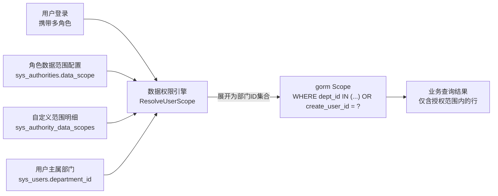

# 数据权限管理体系设计文档

> 版本：v1.0 ｜ 日期：2026-09-05 ｜ 分支：`dq` ｜ 参考：JeeSite 5 数据权限体系（本地 Docker `jeesite` 库实测）

## 本文档集讲什么

gin-vue-admin 原生只有 **API/菜单级的功能权限**（casbin），没有**组织机构维度的行级数据权限**。本设计参考 JeeSite 的数据权限管理体系，为项目补齐：

- **公司管理**（多级公司树，法人/经营主体维度）
- **机构部门管理**（挂靠在公司下的部门树，行政组织维度）
- **数据范围（DataScope）配置**（角色级：全部 / 自定义 / 本公司 / 本部门及以下 / 本部门 / 仅本人）
- **数据权限引擎**（查询时自动追加行级过滤条件，多角色并集合并，gorm Scope 一行接入业务查询）

## 文档目录

| 文档 | 内容 |
| --- | --- |
| [01-总体设计.md](./01-总体设计.md) | 背景与目标、JeeSite 调研结论、总体架构、核心概念与设计原则 |
| [02-数据库设计.md](./02-数据库设计.md) | ER 图、全部表结构 DDL、物化路径设计、与 JeeSite 表的对照 |
| [03-后端设计.md](./03-后端设计.md) | 模块分层、数据权限引擎算法、API 清单、种子数据、配置项 |
| [04-前端设计.md](./04-前端设计.md) | 页面清单、公司/部门管理页、角色数据权限配置、用户挂部门 |
| [05-业务接入指南.md](./05-业务接入指南.md) | 业务表三步接入数据权限，含完整代码示例 |
| [06-测试验证.md](./06-测试验证.md) | 场景矩阵与实测记录 |

## 一图看懂

## 快速使用

1. 启动后端（自动建表 + 幂等种子：菜单、API、casbin 规则、演示组织数据）
2. 「超级管理员 → 公司管理 / 部门管理」维护组织树
3. 「用户管理」编辑用户 → 选择主属部门
4. 「角色管理 → 设置权限 → 数据权限」选择角色的数据范围
5. 业务查询接入：见 [05-业务接入指南.md](./05-业务接入指南.md)，一行 `Scopes` 即可
